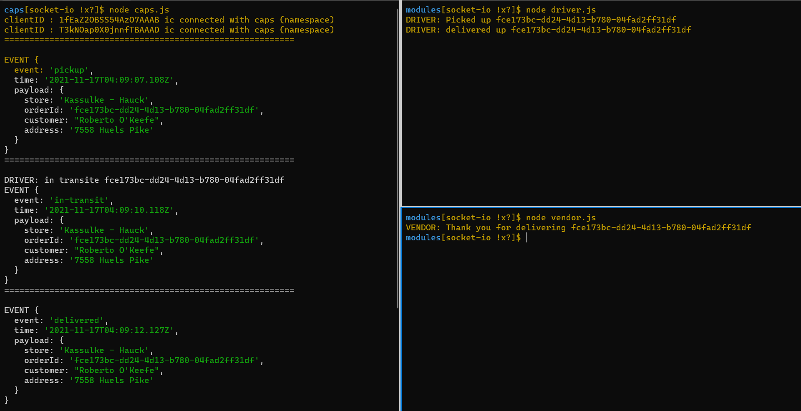
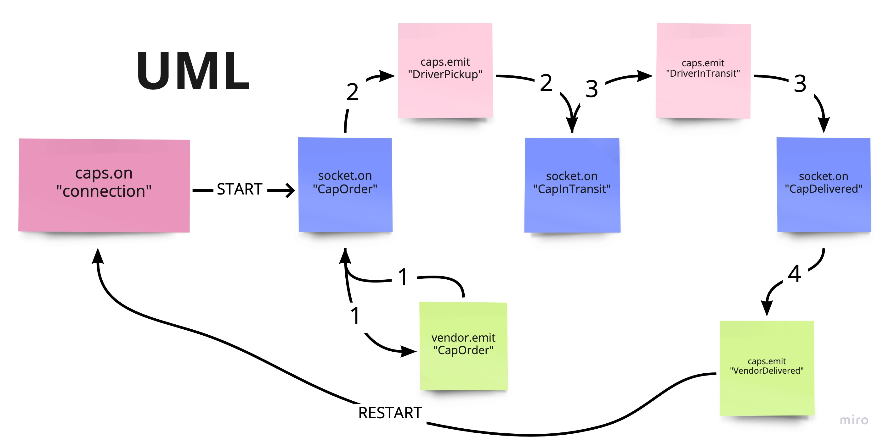

# CAPS - The Code Academy Parcel Service

## Author: Amr Nzzal

## ♥ [Pull Request - 02](https://github.com/amr88nzzal/caps/pull/3)

 

## User Stories

### Client

- As a vendor, I want to alert the system when I have a package to be picked up
- As a driver, I want to be notified when there is a package to be delivered
- As a driver, I want to alert the system when I have picked up a package and it is in transit
- As a driver, I want to alert the system when a package has been delivered
- As a vendor, I want to be notified when my package has been delivered

### Developer

- As a developer, I want to use industry standards for managing the state of each package
- As a developer, I want to create an event driven system so that I can write code that happens in response to events, in real time.

 

### Technical Requirements as described in the lab

**In order to switch from Node Events to Socket.io, the refactoring process will involve changes to each application to use the core features of Socket.io.**

 

- As a developer, I want to create network event driven system using Socket.io so that I can write code that responds to events originating from both servers and web applications
- In order to switch from TCP to Socket.io, the refactoring process will involve changes to each application to use the core features of Socket.io
- We’ll use one namespace called `caps` where all of our clients (vendors and drivers) will connect

- As a developer, I want to create network event driven system using Socket.io so that I can write code that responds to events originating from both servers and web applications
- In order to switch from TCP to Socket.io, the refactoring process will involve changes to each application to use the core features of Socket.io
- We’ll use one namespace called `caps` where all of our clients (vendors and drivers) will connect

### CAPS Application Server Modifications: 
- Create and accept connections on a namespace called caps
- Monitor the correct general events: pickup, in-transit, delivered
- Broadcast the events and payload back out to the appropriate clients in the caps namespace
  - Pickup can go out to all sockets (broadcast it) so that the drivers can hear it
  - In-transit and delivered are meant to be heard only by the right vendor

### Vendor Application:
- Connects to the CAPS server as a socket.io client to the caps namespace
- Every .5 seconds, simulate a new customer order
- Listen for the delivered event coming in from the CAPS server

### Driver Application:
- Connects to the CAPS server as a socket.io client to the caps namespace
- Listen for the pickup event coming in from the CAPS server
- Simulate picking up the package
- Simulate delivering the package

### Test

- Open 3 tabs and then run each socket from the root of the directory
  1. `node caps.js`
  2. `node modules/vendor.js`
  3. `node modules/driver.js` 

### UML

