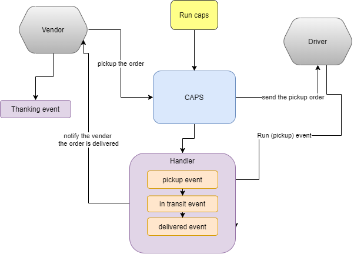

# CAPS - The Code Academy Parcel Service

## Author: Amr Nzzal

## ♠ [Pull Request - 01](https://github.com/amr88nzzal/caps/pull/1)

 
 

## User Stories

### Client

- As a vendor, I want to alert the system when I have a package to be picked up
- As a driver, I want to be notified when there is a package to be delivered
- As a driver, I want to alert the system when I have picked up a package and it is in transit
- As a driver, I want to alert the system when a package has been delivered
- As a vendor, I want to be notified when my package has been delivered

### Developer

- As a developer, I want to use industry standards for managing the state of each package
- As a developer, I want to create an event driven system so that I can write code that happens in response to events, in real time.

 

### Technical Requirements as described in the lab

The CAP system should have the following modules:

 

- `events.js`: Global Event Pool (shared by all modules)
- `caps.js`: Main Hub Application
  - Manages the state of every package (ready for pickup, in transit, delivered, etc)
  - Logs every event to the console with a timestamp and the event payload
  - i.e. “EVENT {}”

- `vendors.js`: Vendor Module
  - Declare your store name (perhaps in a .env file, so that this module is re-usable)
  - Every 5 seconds, simulate a new customer order
    - Create a fake order, as an object: { storeName, orderId, customerName, address }
    - Emit a ‘pickup’ event and attach the fake order as payload. **HINT**: Have some fun by using the faker library to make up phony information
  - Monitor the system for events. Whenever the ‘delivered’ event occurs, Log “thank you” to the console

- `driver.js`: Drivers Module
  - Monitor the system for events
  - On the ‘pickup’ event: 
    - (1) Wait 1 second, (2) Log “DRIVER: picked up [ORDER_ID]” to the console, (3) Emit an ‘in-transit’ event with the payload you received
    - (1) Wait 3 seconds, (2) Log “delivered” to the console, (3) Emit a ‘delivered’ event with the same payload

### Test

run `node caps.js` to see the output of your console logs in your terminal.

### UML

